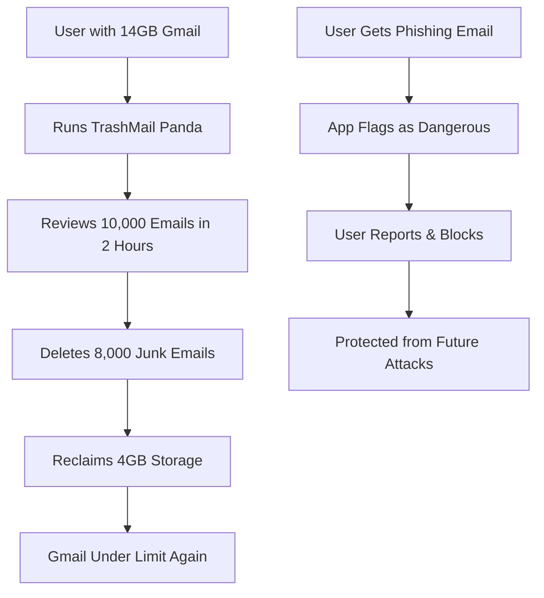
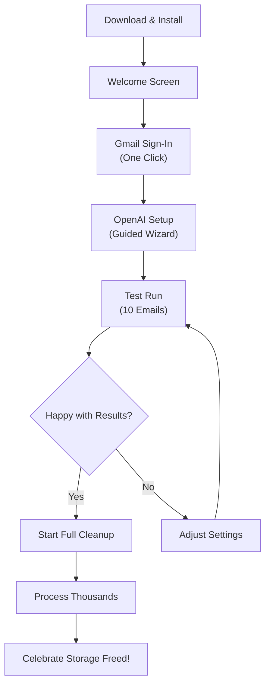
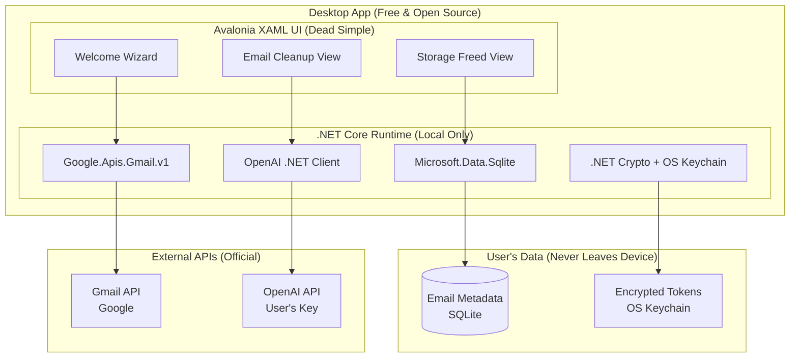
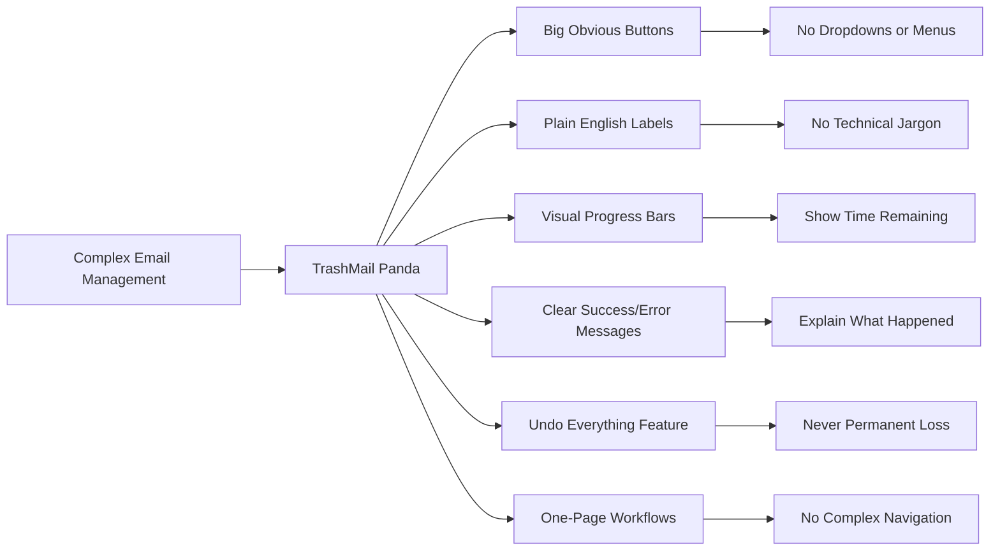
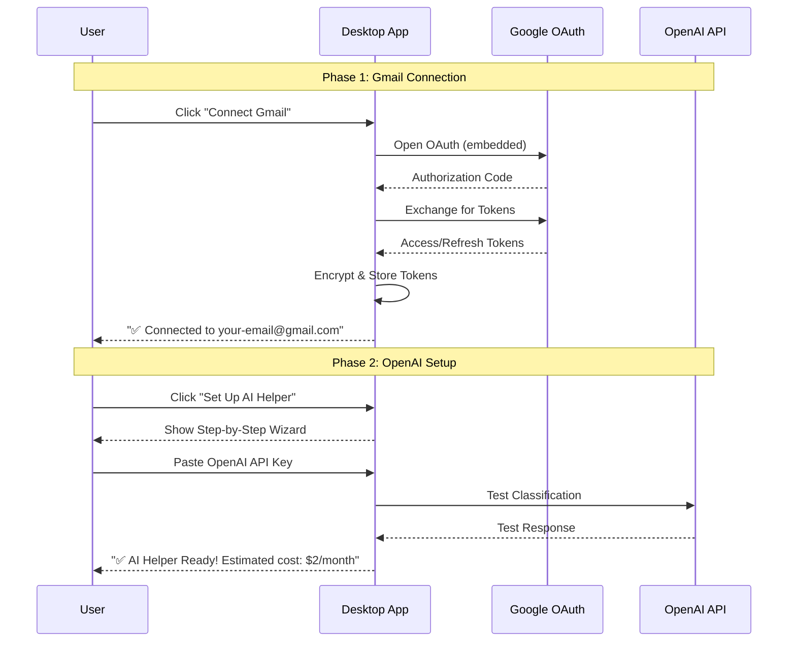

# TrashMail Panda - Product Requirements Document

## Initial Concept

Free, open-source AI-powered email cleanup tool that helps personal Gmail users reclaim storage space and protect against spam/phishing through intelligent bulk processing with dead-simple UX.

---

## Executive Summary

### Problem Statement

Personal Gmail users face storage and security challenges:

- **Storage Exhaustion**: 15GB free storage fills up with thousands of emails over years
- **Security Exposure**: Difficulty identifying phishing and dangerous emails among legitimate ones
- **Cleanup Paralysis**: Fear of accidentally deleting important emails prevents cleanup
- **Technical Barrier**: Existing email management tools too complex for average users

### Solution Overview

TrashMail Panda is a **free, open-source desktop application** that:

- Fetches email batches from personal Gmail accounts using official APIs
- Classifies emails using AI into actionable categories (keep/newsletter/promotion/spam/dangerous)
- Groups similar emails for efficient bulk processing with "for dummies" simplicity
- Proposes safe actions with crystal-clear user approval dialogs
- Learns from user feedback while maintaining complete transparency
- **Never charges fees, never hosts data, never becomes a service**

### Success Metrics

- **Storage Reclaimed**: 2-5GB average space freed per cleanup session
- **Spam Removal**: 5,000-15,000 junk emails removed per user
- **Security Protection**: 100% identification rate of dangerous/phishing emails
- **Usability**: 90%+ task completion rate for non-technical users
- **Adoption**: Wide GitHub community with active contributions

---

## Target Users & Constraints

### Primary User: Personal Gmail Users

- **Volume**: 5,000-50,000 emails accumulated over 3-10+ years
- **Storage**: Approaching or exceeding 15GB Gmail free storage limit
- **Technical Skill**: Ranges from complete beginners to power users
- **Primary Goal**: Free up storage space safely and remove security threats

### Technical Constraints

- **"For Dummies" UX**: Must be usable by users with zero technical knowledge
- **Local-Only Processing**: No cloud services, no data hosting, no user accounts
- **Free Forever**: Open source with no monetization, premium features, or paid services
- **Desktop First**: Avalonia UI cross-platform app for Phase 1
- **Gmail Personal Focus**: Optimized for personal accounts (not enterprise/workspace)

### Success Scenarios



---

## User Stories & Scenarios

### Dead Simple Onboarding Flow



### Core User Stories

#### Epic: Dead-Simple Gmail Cleanup

1. **As a non-technical user**, I want to sign into Gmail with one click so that I don't get confused by technical setup
   - Acceptance Criteria:
     - [ ] Single "Connect Gmail" button
     - [ ] No browser switching or copy-pasting tokens
     - [ ] Clear success message with account info
     - [ ] Automatic reconnection if needed
   - Edge Cases:
     - Two-factor authentication enabled
     - Multiple Gmail accounts logged in

2. **As a storage-concerned user**, I want to see exactly how much space I'll free up before deleting anything
   - Acceptance Criteria:
     - [ ] Storage calculator shows "X GB will be freed"
     - [ ] Preview shows largest email attachments/threads
     - [ ] Clear before/after storage visualization
     - [ ] Option to target specific storage amount (e.g., "Free up 3GB")
   - Edge Cases:
     - Emails with large attachments
     - Shared Google Drive storage

#### Epic: Security Protection for Everyone

3. **As a non-security-expert**, I want obvious warnings about dangerous emails so I can protect myself
   - Acceptance Criteria:
     - [ ] Red alerts with clear "DANGER" messaging
     - [ ] Simple explanations: "This looks like a fake PayPal email"
     - [ ] One-click reporting to Gmail
     - [ ] Educational tips about what makes emails suspicious
   - Edge Cases:
     - Legitimate security emails from banks
     - False positives on important business emails

#### Epic: Bulk Processing Made Simple

4. **As an overwhelmed user**, I want to handle similar emails all at once so I don't spend hours clicking individually
   - Acceptance Criteria:
     - [ ] Clear grouping: "47 emails from Daily Deal newsletters"
     - [ ] Simple action buttons: "Delete All" vs "Keep All"
     - [ ] Storage impact preview: "This will free up 850MB"
     - [ ] Undo option clearly explained
   - Edge Cases:
     - Mixed importance in same group
     - Partial bulk operation failures

---

## System Architecture (Simplified for Open Source)

### High-Level Architecture



### "For Dummies" UI Design Principles



---

## Technical Specifications

### Dead-Simple Authentication Flow



### Storage-Focused Processing

```csharp
// Core models focused on storage and simplicity (C# with nullable reference types)
public record StorageCalculation
{
    public int TotalEmailsFound { get; init; }
    public string EstimatedStorageFreed { get; init; } = string.Empty; // "3.2 GB"
    public StorageCategories LargestCategories { get; init; } = new();
}

public record StorageCategories
{
    public CategoryInfo Promotions { get; init; } = new();
    public CategoryInfo Newsletters { get; init; } = new();
    public CategoryInfo Spam { get; init; } = new();
}

public record CategoryInfo(int Count, string Storage);

public record SimpleClassification
{
    public EmailCategory Category { get; init; } = EmailCategory.Keep;
    public ConfidenceLevel Confidence { get; init; } = ConfidenceLevel.NotSure;
    public string SimpleReason { get; init; } = string.Empty; // "Looks like a newsletter from a store"
    public string StorageImpact { get; init; } = string.Empty; // "Will free up 45MB"
    public string ActionLabel { get; init; } = string.Empty; // "Delete & Unsubscribe"
}

public enum EmailCategory
{
    Keep,
    Newsletters,
    Promotions, 
    Spam,
    Dangerous
}

public enum ConfidenceLevel
{
    VeryUsure,
    PrettySure,
    NotSure
}

public record BulkGroup
{
    public string Id { get; init; } = string.Empty;
    public string SimpleLabel { get; init; } = string.Empty; // "Daily deal emails from 5 stores"
    public int EmailCount { get; init; }
    public string StorageFreed { get; init; } = string.Empty; // "850 MB"
    public BulkActionType ActionType { get; init; } = BulkActionType.Keep;
    public bool Undoable { get; init; } = true;
}

public enum BulkActionType
{
    Delete,
    UnsubscribeAndDelete,
    Keep
}
```

---

## Implementation Strategy (Open Source First)

### Development Phases

```mermaid
gantt
    title TrashMail Panda Development (Open Source)
    dateFormat X
    axisFormat %s

    section Foundation
    Avalonia UI Setup + Basic Views    :done, phase1, 0, 3w
    Gmail OAuth Integration            :done, 3w, 2w
    OpenAI Integration & Testing       :done, 5w, 2w

    section Core Features
    Email Fetching & Storage           :active, phase2, 7w, 3w
    AI Classification System           :10w, 3w
    Simple Triage UI                   :13w, 2w

    section Bulk Operations
    Storage Calculator                 :phase3, 15w, 2w
    Bulk Action System                 :17w, 3w
    Undo & Safety Features             :20w, 2w

    section Polish
    "For Dummies" UX Testing           :phase4, 22w, 2w
    Documentation & Tutorials          :24w, 2w
    GitHub Release & Distribution      :26w, 1w
```

### MVP Definition (Free & Open Source)

**Goal**: Functional Gmail cleanup tool that non-technical users can successfully use

#### Phase 1: Foundation (3 weeks)

- [ ] Avalonia UI cross-platform desktop app
- [ ] Gmail OAuth with embedded flow (no browser switching)
- [ ] OpenAI API integration with cost estimation
- [ ] Microsoft.Data.Sqlite setup with basic email metadata storage
- [ ] Simple welcome wizard that works for beginners
- **Success Criteria**: Any user can connect Gmail and OpenAI without help

#### Phase 2: Core Cleanup (8 weeks)

- [ ] Batch email processing with clear progress indicators
- [ ] AI classification optimized for storage cleanup
- [ ] Storage calculation and visualization
- [ ] Two-pane triage UI with dead-simple Avalonia controls
- [ ] Basic bulk grouping for newsletters and promotions
- **Success Criteria**: Can process 10,000 emails and show storage freed

#### Phase 3: Bulk Operations (7 weeks)

- [ ] Bulk action confirmation with storage impact
- [ ] Safe unsubscribe with HTTP/mailto fallback
- [ ] Undo system with clear time limits
- [ ] Error handling with non-technical explanations
- [ ] Security classification with educational messaging
- **Success Criteria**: Can safely bulk-delete thousands of emails

#### Phase 4: Open Source Polish (5 weeks)

- [ ] Extensive UX testing with non-technical users
- [ ] Complete documentation and video tutorials
- [ ] GitHub release with easy installation
- [ ] Community contribution guidelines
- [ ] Security audit and privacy documentation
- **Success Criteria**: Ready for public GitHub release

---

## Success Criteria (Open Source Project)

### Definition of Done

- [ ] Any user can install and use without technical knowledge
- [ ] Processes 10,000+ emails safely with clear storage impact
- [ ] Zero reports of important emails accidentally deleted
- [ ] Complete documentation including video tutorials
- [ ] Active GitHub community with contributors
- [ ] Security audit passed for credential handling

### Measurable Outcomes

- **Storage Impact**: Average 3+ GB reclaimed per user session
- **Email Volume**: 10,000+ emails processed per cleanup
- **User Success Rate**: 90%+ completion rate for non-technical users
- **Safety Score**: Zero accidental deletion of important emails
- **Community Growth**: 1,000+ GitHub stars, 10+ contributors

### Open Source Success Indicators

- ✅ Users successfully complete cleanup without asking for help
- ✅ Clear documentation that answers all common questions
- ✅ Active GitHub issues and pull requests from community
- ✅ Video testimonials from users who freed up significant storage
- ✅ Zero privacy concerns raised about data handling
- ✅ Translatable UI for international users
- ✅ Easy installation process (one-click installers)

---

## Challenge Analysis (Open Source Context)

### Technical Risks

```yaml
user_experience_complexity:
  risk: 'Technical users over-engineer UI, making it complex for beginners'
  mitigation:
    - 'Mandatory UX testing with non-technical users'
    - 'Simple/Advanced mode toggle'
    - 'User feedback prominently featured in GitHub'

gmail_api_changes:
  risk: 'Google changes APIs breaking functionality'
  mitigation:
    - 'Robust error handling with user-friendly messages'
    - 'Community monitoring of API changes'
    - 'Modular API layer for easy updates'

openai_costs:
  risk: 'Users shocked by OpenAI API costs'
  mitigation:
    - 'Clear cost estimation before processing'
    - 'Processing limits and budgets'
    - 'Documentation about typical costs ($1-5/cleanup)'
```

### Open Source Challenges

```yaml
maintenance_burden:
  risk: 'Core maintainer burnout with support requests'
  mitigation:
    - 'Comprehensive FAQ and troubleshooting docs'
    - 'Community moderators and contributors'
    - 'Clear issue templates and triage process'

security_concerns:
  risk: 'Users worried about email access and API keys'
  mitigation:
    - 'Complete transparency: all code open source'
    - 'Local-only processing clearly documented'
    - 'Security audit by community security experts'
    - 'Easy credential deletion/revocation'
```

---

## Future Roadmap (Post-MVP)

### Community-Driven Features

- Multiple language support
- IMAP support for other email providers
- Advanced filtering and search capabilities
- Export/import of user rules and settings

---

## Appendices

### Open Source Philosophy

- **Free Forever**: No premium features, no paid tiers, no services
- **Privacy First**: Local processing, no data collection, transparent code
- **Community Driven**: User feedback shapes development priorities
- **Educational**: Help users understand email security and management

### Technical Dependencies (All Open Source Compatible)

- **Avalonia UI**: MIT License - Cross-platform .NET desktop framework
- **C# + .NET 8**: MIT License - Application development
- **Microsoft.Data.Sqlite**: MIT License - Local database
- **Google.Apis.Gmail.v1**: Apache 2.0 - Gmail API client
- **OS Keychain APIs**: Platform-specific - Secure credential storage

This PRD establishes TrashMail Panda as a community-focused, privacy-respecting tool that makes Gmail cleanup accessible to everyone while maintaining complete transparency and user control.
